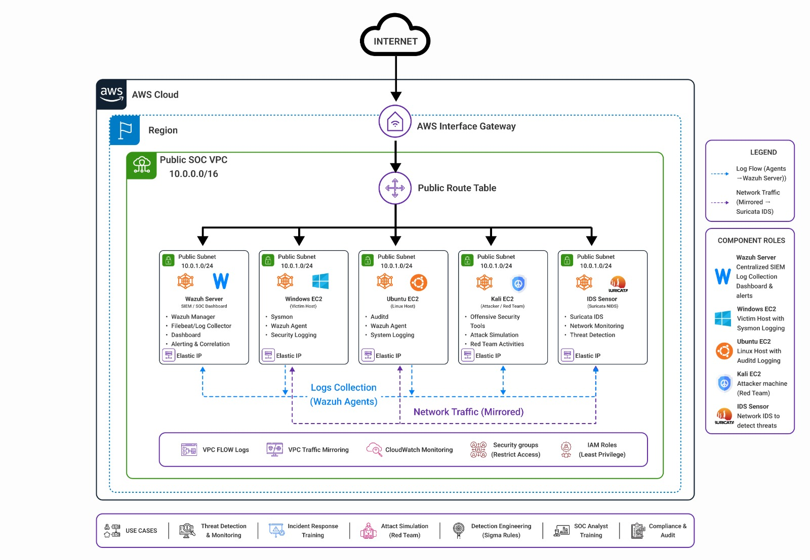
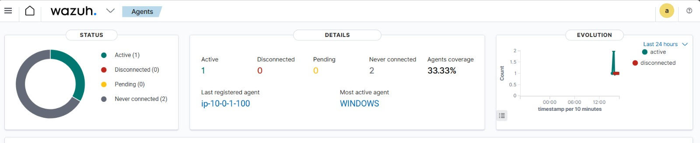
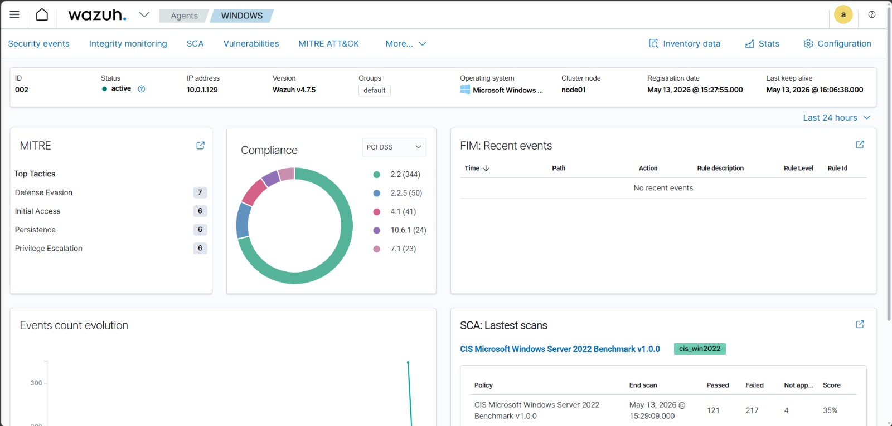

# AWS SOC Lab with Wazuh, Suricata, Sysmon and Auditd


> A manually deployed AWS Security Operations Center lab for endpoint monitoring, network intrusion detection, centralized logging, alert investigation, and SOC analyst practice.

## Project overview

This project extends the experience of building a VMware home SOC lab into AWS Cloud. The goal is to gain practical exposure to AWS networking, EC2 security, centralized telemetry, network detection, alert triage, and incident documentation.

The lab uses:

- **Wazuh** as the SIEM/XDR platform.
- **Windows EC2 + Sysmon** for endpoint telemetry.
- **Ubuntu EC2 + Auditd** for Linux auditing.
- **Suricata** as the network IDS.
- **AWS VPC Traffic Mirroring** to copy selected network traffic to the IDS sensor.
- **Kali Linux EC2** only for authorized, controlled, non-destructive lab simulations.

## Architecture




> **Diagram correction:** The supplied diagrams use the label “AWS Interface Gateway.” The AWS component used for public internet routing is an **Internet Gateway (IGW)**.

## Main components

| Component | Role |
|---|---|
| AWS VPC | Isolated cloud network for the SOC lab |
| Internet Gateway | Internet route for public subnets |
| Wazuh server | SIEM, dashboard, event correlation, FIM, SCA and vulnerability visibility |
| Windows EC2 | Monitored endpoint with Wazuh agent and Sysmon |
| Ubuntu EC2 | Monitored endpoint with Wazuh agent and Auditd |
| Kali EC2 | Authorized simulation host |
| Suricata IDS | Network monitoring and signature detection |
| VPC Traffic Mirroring | Sends copies of selected ENI traffic to Suricata |
| Security Groups | Restrict management, Wazuh and VXLAN traffic |

## Repository structure

```text
SOC-Project-Intermediate/
├── Architecture/
├── Documentation/
├── Scripts/
├── Detection-Rules/
├── Screenshots/
├── Resources/
├── .github/
├── .gitignore
├── LICENSE
├── UPLOAD_TO_GITHUB.md
└── README.md
```

## Implementation guide

1. [AWS infrastructure](Documentation/01-AWS-Infrastructure.md)
2. [Wazuh server](Documentation/02-Wazuh-Installation.md)
3. [Windows agent and Sysmon](Documentation/03-Windows-Sysmon.md)
4. [Ubuntu agent and Auditd](Documentation/04-Ubuntu-Auditd.md)
5. [Suricata IDS](Documentation/05-Suricata-IDS.md)
6. [VPC Traffic Mirroring](Documentation/06-AWS-Traffic-Mirroring.md)
7. [Suricata and Wazuh integration](Documentation/07-Suricata-Wazuh-Integration.md)
8. [Safe alert simulations](Documentation/08-Safe-Alert-Simulations.md)
9. [SOC alert triage](Documentation/09-Alert-Triage.md)
10. [Troubleshooting](Documentation/10-Troubleshooting.md)
11. [Cost control and shutdown](Documentation/11-Cost-Control.md)

## Evidence from the implementation

### Wazuh agent dashboard



### Windows endpoint in Wazuh



Additional screenshots can be added by following [the screenshot checklist](Screenshots/README.md).

## SOC data flow

```text
Endpoint or network activity
            |
            v
Sysmon / Auditd / Suricata
            |
            v
Wazuh agent log collection
            |
            v
Wazuh manager decoding and rule matching
            |
            v
Wazuh indexer and dashboard
            |
            v
Analyst validates, scopes, contains and documents
```

## Demonstration scenarios

The repository uses safe, authorized tests rather than destructive payloads:

- Manual failed-login attempts against a dedicated test account.
- A benign PowerShell command containing a lab marker.
- File creation, modification and deletion in a monitored folder.
- A limited Nmap scan against a private IP owned by the lab.
- A custom Suricata rule triggered by a benign HTTP request.
- Sudo and Auditd activity on the Ubuntu endpoint.

## Learning outcomes

- Build AWS networking manually through the console.
- Deploy Wazuh and onboard Windows and Linux agents.
- Collect Sysmon, Windows Security, Linux authentication and Auditd events.
- Configure Suricata and VPC Traffic Mirroring.
- Investigate alerts by user, process, host, IP address and timestamp.
- Map relevant detections to MITRE ATT&CK.
- Create an evidence-backed incident record.
- Apply cost-control and cloud-security practices.

## Security and privacy

- Use only systems you own or are explicitly authorized to test.
- Keep SSH and RDP restricted to your current public IP.
- Never commit private keys, credentials, tokens or AWS access keys.
- Redact account IDs, public IP addresses, instance IDs, usernames and browser URLs before publishing screenshots.
- Do not expose Wazuh API port `55000` to the public internet.
- Stop or terminate unused EC2 resources to prevent unexpected charges.

## Version note

The sample scripts were prepared against the official documentation available in **July 2026**. Wazuh package versions change over time. Before installing, compare the version variables in the scripts with the current official package list. Keep the **Wazuh manager version equal to or newer than the agent version**.

## Disclaimer

This repository is for defensive-security education and controlled lab use. Do not scan, test or access third-party systems without explicit written authorization.
